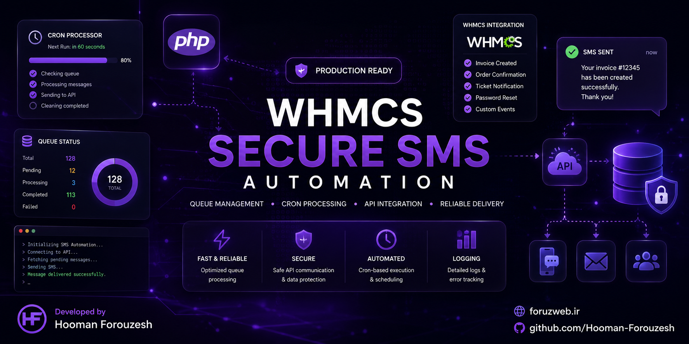

  

# 🚀 WHMCS Secure SMS Automation

A professional SMS automation module for WHMCS that delivers reliable and intelligent SMS notifications through scheduled queue processing.

## ✨ Features

- 📩 Automated SMS Queue Processing
- ⏰ Cron-based Automation
- 🔄 Retry Failed Messages
- ⚡ High Performance Queue Management
- 📊 Activity Logging
- 🔐 Secure API Communication
- 👥 Client Notifications
- 💰 Invoice Notifications
- 🎫 Support Ticket Notifications
- 📱 IPPanel SMS Gateway Integration

---

## 🛠 Technologies

- PHP
- WHMCS
- MySQL
- Cron Jobs
- REST API
- HTML
- CSS
- JavaScript

---

## Highlights

- Modular Architecture
- Queue-based SMS Delivery
- Automatic Cron Execution
- Error Handling & Logging
- Optimized Performance
- Production Ready

---

## Live Environment

Integrated into production WHMCS environments.

---

## Website

https://foruzweb.ir

---

## Author

**Hooman Forouzesh**

Founder of ForuzWeb

🌐 https://foruzweb.ir

💼 https://www.linkedin.com/in/hooman-forouzesh

💻 https://github.com/Hooman-Forouzesh

---

⭐ If you find this project interesting, please leave a Star.
